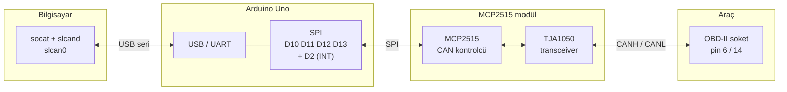

# Donanım rehberi

Adaptörün kurulumu, kablolaması ve devreye alınması. Bir araca
bağlanmadan önce bu belgeyi baştan sona okuyun — özellikle
[sonlandırma direnci](#120-Ω-sonlandırma-direnci-en-sık-yapılan-hata)
bölümünü.

---

## İçindekiler

- [Malzeme listesi](#malzeme-listesi)
- [Bağlantı şeması](#bağlantı-şeması)
- [120 Ω sonlandırma direnci (en sık yapılan hata)](#120-Ω-sonlandırma-direnci-en-sık-yapılan-hata)
- [Hangi kristal?](#hangi-kristal)
- [MCP2515 modül çeşitleri](#mcp2515-modül-çeşitleri)
- [Besleme](#besleme)
- [OBD-II konnektörü](#obd-ii-konnektörü)
- [Devreye alma kontrol listesi](#devreye-alma-kontrol-listesi)
- [Ölçüm değerleri](#ölçüm-değerleri)
- [Yaygın arızalar](#yaygın-arızalar)

---

## Malzeme listesi

| # | Parça | Not |
|---|---|---|
| 1 | Arduino Uno R3 | Nano veya Pro Micro da olur |
| 1 | MCP2515 + TJA1050 CAN modülü | Kristal değerine dikkat |
| 1 | OBD-II erkek konnektör kablosu | Ucu açık, "OBD2 pigtail" |
| 1 | DC-DC step-down (12 V → 5 V) | Araç beslemesi kullanılacaksa |
| 6 | Dişi-dişi jumper kablo | SPI + besleme |
| 1 | Multimetre | Devreye alma için şart |

Toplam maliyet yaklaşık 300-500 TL (2025).

> **TJA1050 vs MCP2551:** İkisi de çalışır. TJA1050 5 V mantık
> seviyesiyle uyumludur ve daha yaygındır. MCP2551 biraz daha eski ama
> aynı işi görür.

---

## Bağlantı şeması



### Arduino ↔ MCP2515 modülü

| MCP2515 modül | Arduino Uno | Açıklama |
|---|---|---|
| `VCC` | `5V` | Modül 5 V ile beslenir |
| `GND` | `GND` | Ortak toprak |
| `CS` | `D10` | Chip select — `config.h`'de değiştirilebilir |
| `SO` (MISO) | `D12` | Modülden Arduino'ya |
| `SI` (MOSI) | `D11` | Arduino'dan modüle |
| `SCK` | `D13` | SPI saati |
| `INT` | `D2` | Kesme — firmware yoklama yapsa da bağlayın |

> Nano'da pinler aynıdır. Pro Micro'da SPI pinleri farklıdır
> (ICSP başlığı: MOSI=16, MISO=14, SCK=15); `config.h`'de sadece
> `MCP2515_CS_PIN` ve `MCP2515_INT_PIN` ayarlanır, SPI pinlerini
> kütüphane kendi bulur.

### MCP2515 modülü ↔ araç

| MCP2515 modül | OBD-II pini | Açıklama |
|---|---|---|
| `CANH` | pin 6 | HS-CAN High (500 kbit/s) |
| `CANL` | pin 14 | HS-CAN Low |
| `GND` | **pin 5** | Sinyal toprağı — pin 4 **değil** |

Ford MS-CAN için pin 3 (H) / pin 11 (L), 125 kbit/s.
Ayrıntı: [obd_ii_reference.md](ford/obd_ii_reference.md).

> Neden pin 4 değil: pin 4 şase toprağıdır ve üzerinden far, marş, fan
> gibi tüketicilerin dönüş akımı geçer. Bu akımlar birkaç yüz milivoltluk
> gerilim düşümleri yaratır ve ölçümü bozar. Gerekçe:
> [cruze_2010_16_ls.md](chevrolet/cruze_2010_16_ls.md).

---

## 120 Ω sonlandırma direnci (en sık yapılan hata)

CAN hattı, **iki ucundan** 120 Ω ile sonlandırılır. Araçta bu iki direnç
zaten vardır (genelde ECM ve en uzaktaki modülün içinde). Toplam hat
direnci bu yüzden 60 Ω'dur.

Piyasadaki MCP2515 modüllerinin neredeyse hepsinde **üçüncü bir 120 Ω
direnç lehimli gelir.** Bunu takarsanız toplam direnç 40 Ω'a düşer,
sinyal seviyeleri bozulur ve tipik olarak şu olur: bazı frame'ler gelir,
bazıları bozuk gelir, araç modülleri hata sayacı biriktirir.

**Ne yapmalı:**

1. Kontak kapalıyken, OBD soketinde pin 6 ile pin 14 arasını ölçün.
   Yaklaşık **60 Ω** görmelisiniz.
2. Modülün üzerinde `J1` etiketli bir jumper varsa **çıkarın**.
3. Jumper yoksa, kart üzerindeki 120 Ω direnci (genelde `R1` veya
   `120R` yazar) **sökün** veya bir bacağını kaldırın.
4. Modülü söktükten sonra CANH-CANL arasını ölçün: artık açık devre
   (∞) veya çok yüksek direnç olmalı.

```
Doğru:                          Yanlış:
  [ECU 120Ω]---bus---[120Ω ECU]   [ECU 120Ω]---bus---[120Ω ECU]
                │                                │
           [modül, direnç yok]              [modül + 120Ω]
           toplam 60 Ω                      toplam 40 Ω
```

> İstisna: masa üstünde iki MCP2515 modülünü birbirine bağlayarak test
> ediyorsanız, o zaman **her iki modülde de** direnç takılı olmalıdır.

---

## Hangi kristal?

Yanlış kristal ayarı, "hiçbir şey çalışmıyor ama donanım sağlam"
durumunun bir numaralı sebebidir. `config.h`:

```c
#define MCP2515_CRYSTAL MCP_8MHZ    // veya MCP_16MHZ
```

Nasıl anlaşılır:

1. Modülün üzerindeki gümüş metal kutuya bakın. Üzerinde yazar:
   - `8.000` veya `8M` → `MCP_8MHZ`
   - `16.000` veya `16M` → `MCP_16MHZ`
2. Yazı okunmuyorsa: mavi renkli, "niren" baskılı yaygın modüller
   genelde **8 MHz**'tir.
3. Emin değilseniz ikisini de deneyin — yanlış ayar donanıma zarar
   vermez, sadece hiç frame gelmez.

Emin olmanın kesin yolu: `l` (loopback) modu. Loopback'te gönderdiğiniz
frame geri geliyorsa SPI zinciri ve kristal ayarı doğrudur.

---

## MCP2515 modül çeşitleri

| Görünüm | Kristal | Not |
|---|---|---|
| Mavi kart, "niren" baskı | 8 MHz | En yaygın, ucuz |
| Siyah/yeşil kart, geniş | 16 MHz | Genelde daha temiz tasarım |
| Üzerinde `SN65HVD230` yazan | — | **Bu MCP2515 değil**, 3.3 V transceiver'dır; SPI yoktur |

`SN65HVD230` modülü bu proje ile çalışmaz: içinde CAN kontrolcüsü
yoktur, sadece transceiver'dır (ESP32/STM32 gibi dahili CAN çevre birimi
olan kartlar içindir).

---

## Besleme

İki seçenek var:

**A) USB'den (önerilen, başlangıç için)**
Arduino'yu dizüstünüzden besleyin. En basiti, ve araçla bilgisayar
arasında galvanik bağlantı zaten USB üzerinden kurulur.

**B) Araçtan (pin 16)**
OBD pin 16, kontak kapalıyken bile ~12 V verir. Bir DC-DC step-down ile
5 V'a düşürüp Arduino'nun `5V` pinine (VIN değil) verin.

> Araç beslemesi kullanırken **araç aküsü ile bilgisayarın toprakları
> birleşir.** Dizüstü prize takılıysa toprak döngüsü oluşabilir. Dizüstü
> bilgisayarı bataryayla çalıştırmak en güvenlisidir.

> Arduino'nun `VIN` pinine doğrudan 12 V vermek teknik olarak mümkündür
> ama üzerindeki lineer regülatör ısınır ve araç ortamındaki gerilim
> sıçramalarına (load dump, 40 V'a kadar) dayanmaz. DC-DC kullanın.

---

## OBD-II konnektörü

```
        ______________________
       |  1  2  3  4  5  6  7  8 |
       |  9 10 11 12 13 14 15 16 |
       \________________________/
```

| Pin | Yaygın kullanım |
|---|---|
| 1 | Üretici özel (GM: SWCAN, Ford: bazı modellerde MS-CAN) |
| 3 | Ford MS-CAN High |
| 4 | Şase toprağı |
| 5 | **Sinyal toprağı** — referans olarak bunu kullanın |
| 6 | **CAN High** (HS-CAN) |
| 7 | K-Line (ISO 9141 / KWP2000, eski araçlar) |
| 11 | Ford MS-CAN Low |
| 14 | **CAN Low** (HS-CAN) |
| 16 | +12 V, kontaktan bağımsız |

Kalan pinler üretici özeldir veya kullanılmaz.

---

## Devreye alma kontrol listesi

Sırayla ilerleyin; bir adım geçmeden sonrakine geçmeyin.

### 1. Araçsız — SPI zinciri

```bash
make upload PORT=/dev/ttyUSB0
sudo ./scripts/slcan-up.sh
```

`slcan-up.sh` hata vermeden bitiyorsa MCP2515 SPI üzerinden cevap
veriyor demektir. Hata alıyorsanız:

- Kabloları kontrol edin (MISO/MOSI karışmış olabilir)
- `MCP2515_CS_PIN` doğru mu?
- Modüle 5 V gidiyor mu? (multimetre ile ölçün)

### 2. Araçsız — loopback testi

Firmware'in uçtan uca çalıştığını, araca hiç bağlanmadan doğrular.

```bash
# Terminal 1
candump slcan0

# Terminal 2
cansend slcan0 123#DEADBEEF
```

Loopback modunda gönderdiğiniz frame geri gelmelidir. Gelmiyorsa
kristal ayarını değiştirip tekrar deneyin.

### 3. Araçta — ölçüm

Kontak **kapalı**, modül **bağlı değil**:

- OBD pin 6 ↔ pin 14 arası: **~60 Ω**
- OBD pin 16 ↔ pin 5 arası: **~12 V**
- OBD pin 4 ↔ pin 5 arası: **< 0.1 V**

60 Ω yerine 40 Ω görüyorsanız modül hâlâ bağlıdır veya araçta ek bir
sonlandırma vardır. 120 Ω görüyorsanız hattın bir ucu kopuktur.

### 4. Araçta — pasif dinleme

**Modülü bağlamadan önce firmware'i salt-okunur derleyin.**

```c
/* config.h */
#define SLCAN_READ_ONLY 1
```

```bash
make upload PORT=/dev/ttyUSB0
# modülü OBD'ye bağla, kontağı aç (motoru çalıştırma)
sudo ./scripts/slcan-up.sh -a      # bit hızını otomatik bul
candump slcan0
```

Akan trafiği görüyorsanız kurulum tamamdır.

### 5. Araçta — yazma (sadece gerekiyorsa)

`SLCAN_READ_ONLY 0` ile yeniden yükleyin. Kontak açık, motor kapalı,
araç hareketsiz. Önce en zararsız isteği deneyin:

```bash
cansend slcan0 7DF#0201000000000000    # desteklenen PID'ler
```

---

## Ölçüm değerleri

Bir CAN hattının sağlıklı görünüşü (osiloskop veya multimetre):

| Ölçüm | Boşta (recessive) | Veri (dominant) |
|---|---|---|
| CANH ↔ GND | ~2.5 V | ~3.5 V |
| CANL ↔ GND | ~2.5 V | ~1.5 V |
| CANH ↔ CANL | ~0 V | ~2 V |

Multimetre ortalama ölçtüğü için trafik varken CANH ≈ 2.6-2.8 V,
CANL ≈ 2.2-2.4 V civarı okursunuz. İkisi de tam 2.5 V ise hat sessizdir;
biri 0 V veya 5 V'a yapışmışsa hat arızalıdır.

---

## Yaygın arızalar

| Belirti | Sebep | Çözüm |
|---|---|---|
| `slcan-up.sh` MCP2515 hatası veriyor | SPI kablo hatası | MISO/MOSI'yi kontrol edin, CS pinini doğrulayın |
| Loopback çalışıyor, araçta veri yok | Yanlış bit hızı | `slcan-up.sh -a` ile otomatik tespit edin |
| Loopback çalışıyor, araçta veri yok | Yanlış pinler | HS-CAN 6/14, Ford MS-CAN 3/11 |
| Frame'lerin bir kısmı bozuk geliyor | 120 Ω fazla sonlandırma | Modüldeki direnci sökün |
| Frame'lerin bir kısmı bozuk geliyor | Seri hız uyuşmazlığı | `config.h` ile `-b` aynı olmalı |
| Araç gösterge panelinde hata ışıkları | Adaptör yanlış hızda bus'ı sürüyor | Derhal sökün, `SLCAN_READ_ONLY 1` ile yükleyin |
| Frame kaybı, `F` komutu `09` dönüyor | Seri port darboğazı | Baud'u 500000 yapın veya donanım filtresi kurun |
| Rastgele reset / kopma | Besleme yetersiz | USB'den besleyin veya DC-DC'yi kontrol edin |
| Kontağı kapatınca adaptör donuyor | Bus uykuya geçti | Normal; kontağı açın |

---

## Sonraki adım

Kurulum tamamsa:

- [README — kullanım örnekleri](../README.md#kullanım-örnekleri)
- [ISO-TP ve UDS](iso_tp_uds.md) — çok çerçeveli teşhis
- `tools/candiff.py` — hangi mesajın ne anlama geldiğini bulmak
